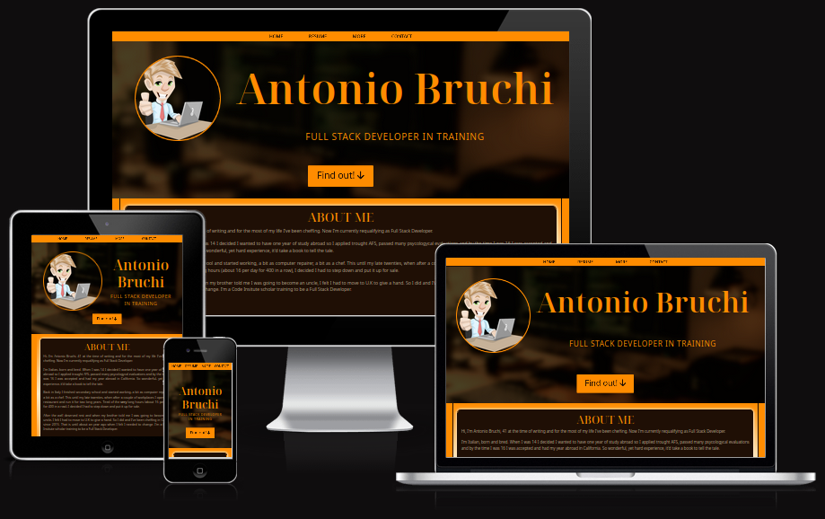

# Antonio Bruchi's Personal Website

## This is my main marketing website

It was developed to showcase my ability to design and create a static website.

## Demo

## [Live website](https://antoniobruchidev.github.io/my-personal/website)

## Table of Contents

- [Antonio Bruchi's Personal Website](#antonio-bruchi's-personal-website)
  - [This is my main marketing website.](#this-is-my-main-marketing-website)
  - [Demo](#demo)
  - [Live website](#live-website)
  - [Table of Contents](#table-of-contents)
    - [UX](#ux)
    - [User stories](#user-stories)
      - [Strategy](#strategy)
      - [Scope](#scope)
      - [Structure](#structure)
      - [Skeleton](#skeleton)
        - [Wireframes](#wireframes)
      - [Surface](#surface)
    - [Technologies](#technologies)
    - [Features](#features)
      - [Existing Features](#existing-features)
      - [Features Left to Implement](#features-left-to-implement)
    - [Testing](#testing)
      - [Validator Testing](#validator-testing)
      - [Bugs](#bugs)
    - [Deployment](#deployment)
    - [Credits](#credits)
      - [Acknowledgements](#acknowledgements)

## UX

The website targets potential recruiters.

## User stories

As this page is my main marketing website it

- As a first time user, I want to understand the purpose of this website quickly and easily.
- As a first time user, I want to easily navigate this website (by using a mouse, a keyboard, or a touch screen).
- As a first time user, I want to view this candidate's work and education history and skills.
- As a returning user, I want a way to contact this candidate.
- As a returning user, I want to get a copy of the candidate's traditional CV.
- As a frequent user, I might want to share the page.
- As a frequent user, I might want to know more about his project(s).

### Strategy

The goal is to make a well-functioning professional CV website. The focus was on making the design both user-friendly and captivating.

### Scope

I wanted to give users a brief summary of my life, giving detailed information about my education and work experiences. This and the ability to show them properly and in captivating yet standard way will give them all the information they need.

### Structure

My Personal Website has a single, long, scrolling page design. My structure features a top navigation that connects the user to each of the sections plus it triggers the modal for my contact form. I included navigation buttons in every section to go to the next section or back at the top. I also included a link to a traditional CV in PDF format

**Website Sections:**
| Section                | Content                                                       |
|------------------------|---------------------------------------------------------------|
| Landing page           | A nice hero section                                           |
| About                  | A brief introduction about myself                             |
| Education              | My education history                                          |
| Work Experiences       | My work history                                               |
| More                   | A bit more about me with some spoiler about a future project  |
| Contacts & Download    | Contact links in the footer and contact form in the modal     |

### Skeleton

The website is designed to be clear and simple. It has four sections stacked on top of each others, all of them scale responsivly to viewport width.

#### Wireframes

The wireframes are designed using Balsamiq software. This second draft was edited after the second session with my mentor.
- [Hero](.assets/pdf/wireframehero.pdf)
- [About](.assets/pdf/wireframeabout.pdf)
- [Education & Work experiences](.assets/pdf/wireframeeduwork.pdf)
- [More](.assets/pdf/wireframemore.pdf)
- [Contac Modal](.assets/pdf/wireframecontactmodal.pdf)

### Surface

I have selected "darkorange" as background color visible only in the navbar and in the two thin side borders. I gave the sections as background image a linear gradient from darkorange to a light beige "#ffebc8" and back to darkorange with the content wrapped in a container with dark background "#1f0f05" sitting on top producing a nice backlight effect. Text is displayed with the light beige or darkorange on the darker background.

## Technologies

1. HTML - To create a basic site
2. CSS - To create a nice, standout front-end and to give a great user experience
3. JQuery - To hide the modal after submit the form but preventing refresh.
4. JS - To reset form values. Responsive WhatsApp share link that on desktop size and larger redirects to WhatsApp Web instead to "open with" dialog.

## Testing

- I tested the site, and it works in different web browsers: Chrome, Firefox, and Microsoft Edge.
- On mobile devices, I tested the my site on a Pixel 7 Pro and on a Pixel 5 on Chrome browser, on an Iphone 15 Pro on Safari browser and on a HUWAEI P30 Lite on its default browser.
- I confirmed that the site is responsive and functions on different screen sizes using the devtools device toolbar.
- I confirmed that the navigation and the sections Home, Experience, Education, Skills, and Contact are readable and easy to understand.
- I confirmed that the form works: it requires entries in every field, only accepts an email in the email field, and button works successfully dumping data in my Google Sheets.
- I confirmed that the Download CV link will download the pdf copy of the traditional CV to the device on which the site is open.

### Validator Testing

- **HTML**
  No errors were returned when passing through the official [W3C validator](https://validator.w3.org/nu/?doc=https%3A%2F%2Fantoniobruchidev.github.io%2Fmy-personal-website%2F)

- **CSS**
  No errors were found when passing through the official 
  
- **Accessibility**
  I confirmed that the colors chosen are easy to read and accessible by running it through [WebAIM Contrast Checker](https://webaim.org/resources/contrastchecker/)
  - [Orange on Brown](hhttps://webaim.org/resources/contrastchecker/?fcolor=FF8C00&bcolor=1F0F05)
  - [Beige on Brown](https://webaim.org/resources/contrastchecker/?fcolor=FFEBC8&bcolor=1F0F05)

### Bugs

- **Solved bugs**

  - When I shared my website with WhatsApp share link on a desktop device there was of course no software to run "whatsapp://" links. I implemented Javascript to change the url on desktop devices and larger into '"https://web.whatsapp.com:/send?text=" + my url'. More info in credits.
  - Input values of the forms did not disappear after submit, so i had to customize the trigger with some script to reset the values before triggering the modal again. Also to restore .readOnly property of the "projectsummary" field that it's set to true by the modal trigger in the more section.

## Deployment

- The site was deployed to Git Hub pages using the following steps:
  - In the Github repository, the Stetting tab.
  - Under General, navigate to Code and Automation and select 'Pages'.
  - In the Build and Deployment section for Source, select 'Deploy from a branch' from the drop-down list.
  - For Branch, select 'main' from the drop-down list and Save.
  - On the top of the page, the link to the complete website is provided.
  
  - The deployed site will update automatically upon new commits to the master branch.

## Credits

- Form and modal behaviour
    - [Use of fetch(...).then() to submit form](https://stackoverflow.com/questions/46640024/how-do-i-post-form-data-with-fetch-api)
    - [Prevent from reloading page on submit](https://adnan-tech.com/prevent-form-submit-event-from-reloading-the-page/)
    - [Modal close - Bootstrap doc](https://getbootstrap.com/docs/4.6/components/modal/)
- [Whatsapp Share button](https://www.c-sharpcorner.com/article/whatsapp-web-and-mobile-sharing-in-javascript/) and modified for my use.

### Acknowledgements
- My mentor, Medale Oluwafemi, for his invaluable guidance.